<h2>Qu'est-ce qu'<b>Anno 1702</b> ❓</h2>

<b>Anno 1702</b> est un jeu textuel de gestion et de stratégie en temps réel. Il se déroule durant la période de l’âge d’or de la marine à voile, au moment de la colonisation 
des Amériques. Le principe du jeu est de développer une colonie en subvenant à ses besoins par la mise en place d’habitations pour accueillir des colons, 
établir des industries afin de les faire évoluer et assurer l’approvisionnement en ressources. 
Le joueur doit prendre garde au déficit entraînant la faillite et l’abandon, et doit porter une attention particulière au niveau de bonheur de la colonie 
car les parties sont rythmées de pléthore d’évènements impromptus pouvant entraîner la pagaille dans la colonie.

 
<i>:warning: Ce projet a été réalisé dans un cadre pédagogique. À ce titre, il n'a pas vocation à être utilisé en-dehors de ce cadre. 
Les différents éléments scénaristiques, lieux et personnages utilisés dans ce projet appartiennent à leurs propriétaires respectifs.</i>

<h2>💻Technologies utilisée</h2>
<h3>Langages</h3>
<ul>
  <li>Pascal</li>
</ul>
<h3>EDI & Logiciels</h3>
<ul>
  <li>Lazarus</li>
  <li>Github Desktop</li>
  <li>Excel</li>
</ul>

<h2>:books:Librairie fournie</h2>

Une librairie servant à la gestion graphique est fournie. Elle permet, grâce à diverses procédures, de dessiner à l'écran (des formes), écrire du texte, changer la taille de la fenêtre...

<h2>📜Fonctionnalités développées</h2>

  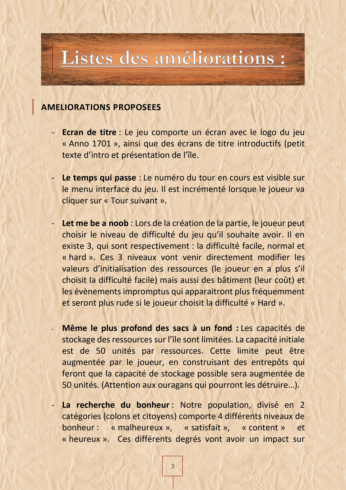
  
  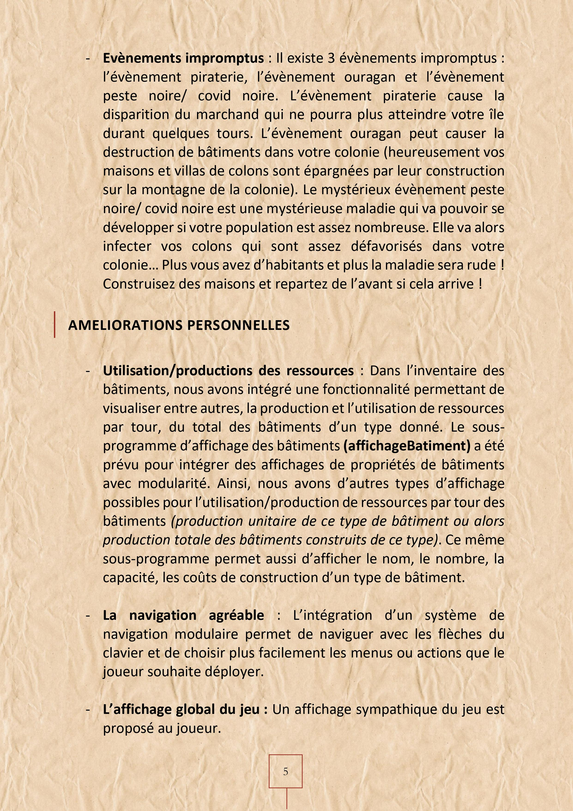

<h2>Le détail de chaque unité</h2>

  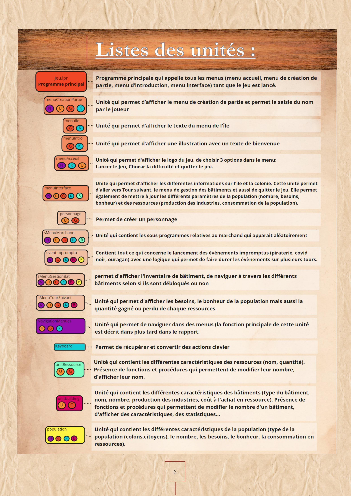
  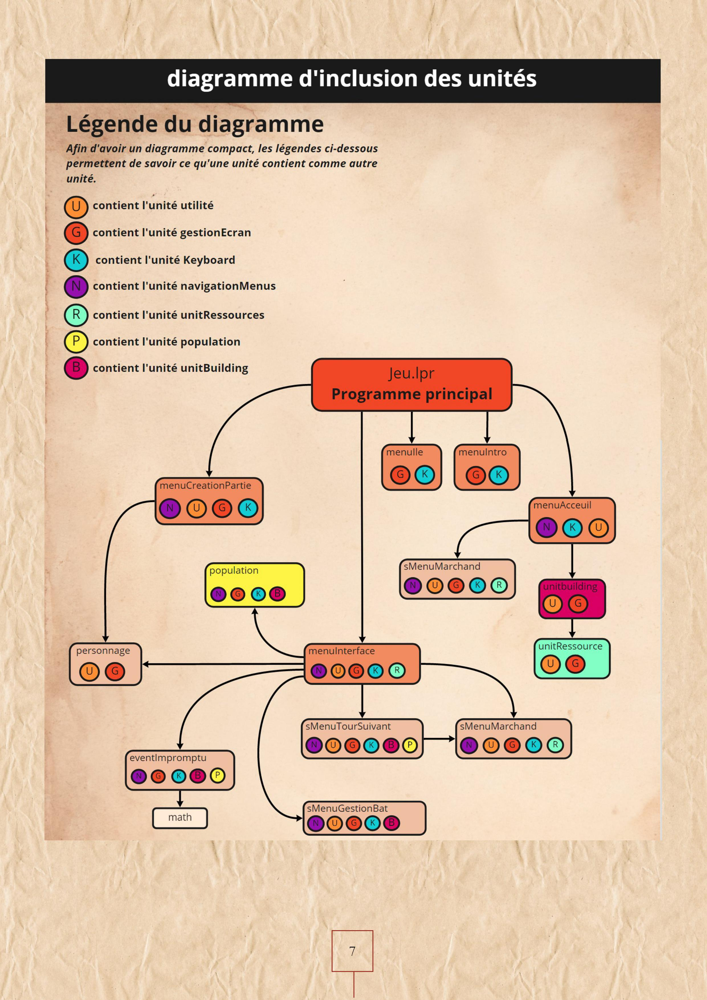

<h2>La navigation dans les menus</h2>

La mise en place de la navigation au clavier dans le jeu a été une tâche qui s'est avérée complexe. Afin de développer cette fonctionnalité, j'ai effectué différents jeux d'essais qui m'ont permis d'élaborer un algorithme répondant au besoin.

  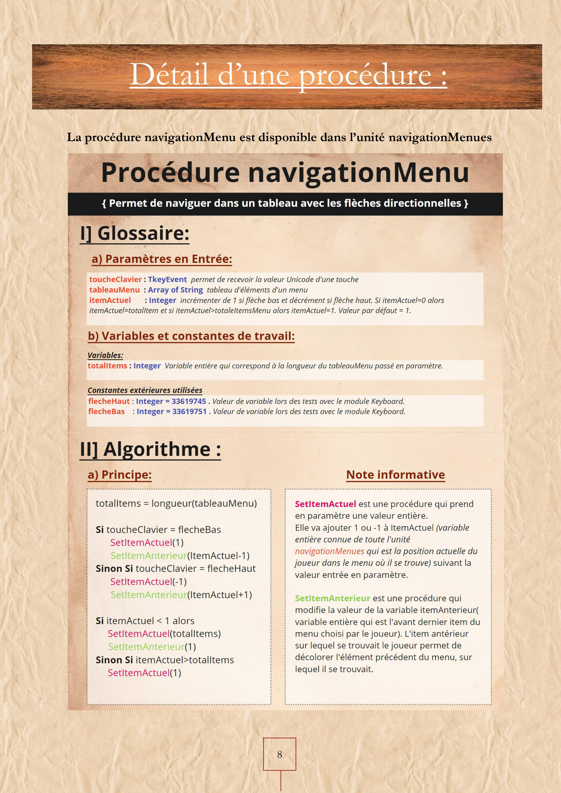
  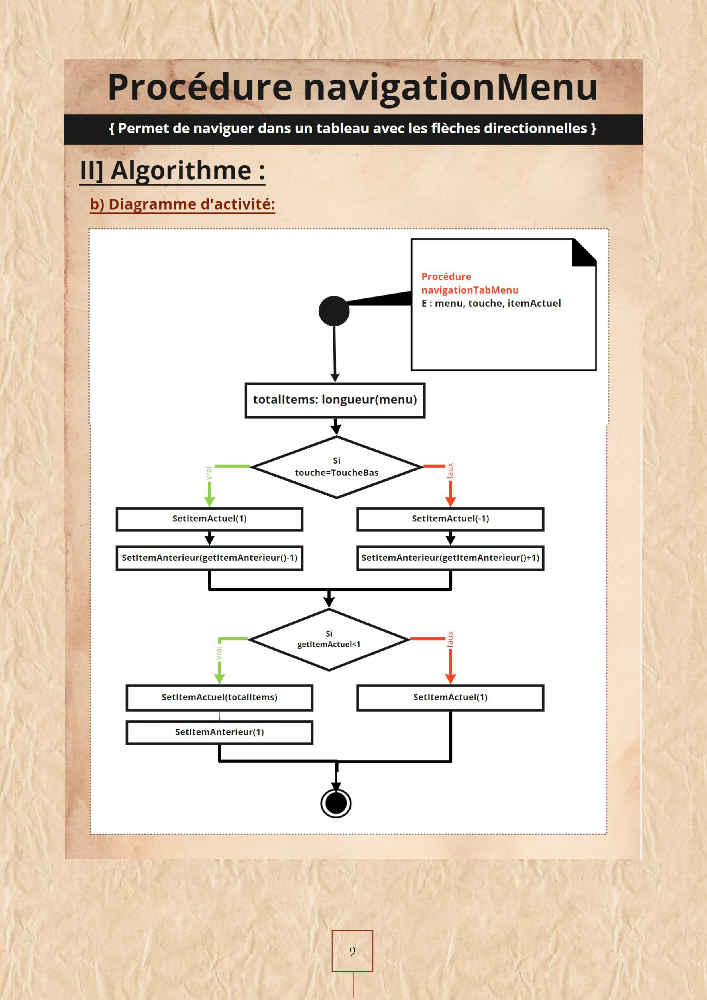
  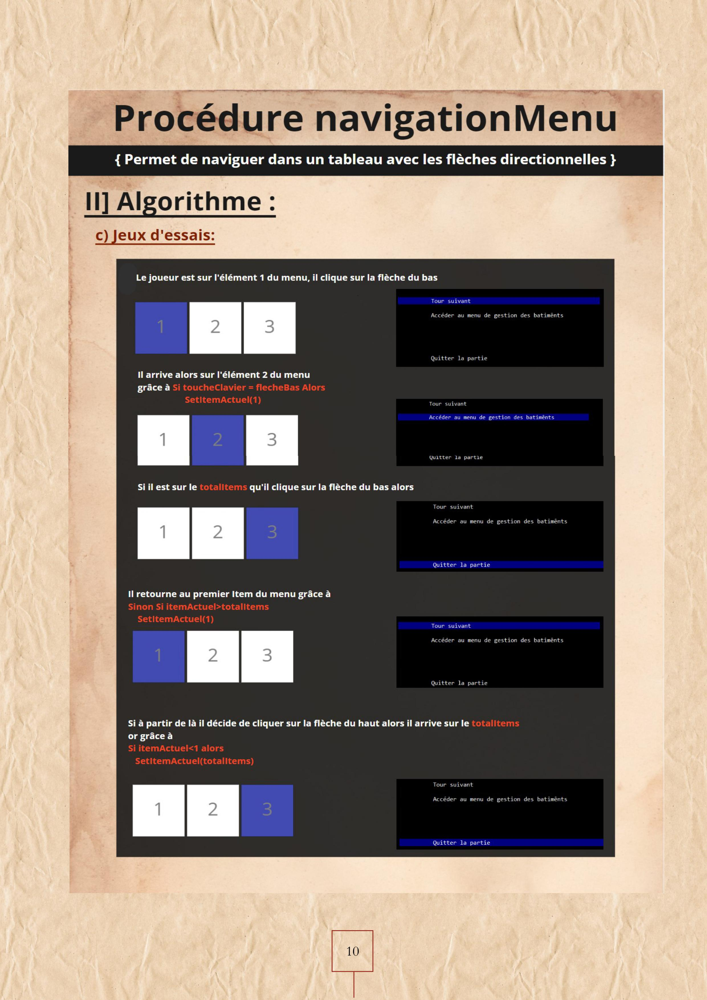

<h2>Méthodes et système de jeu détaillé</h2>
  

    
    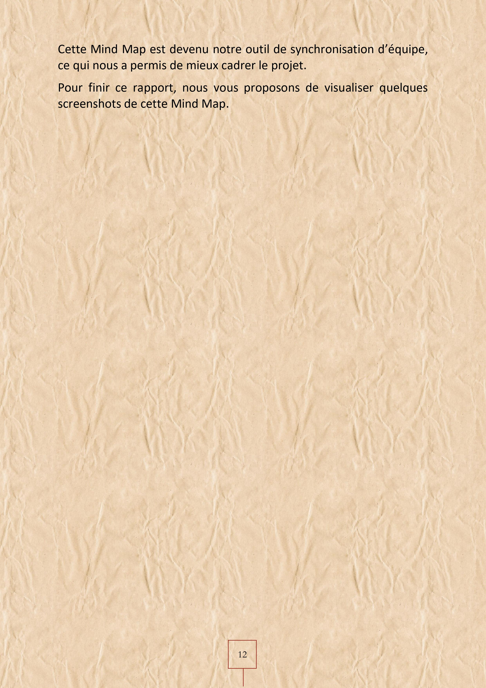
    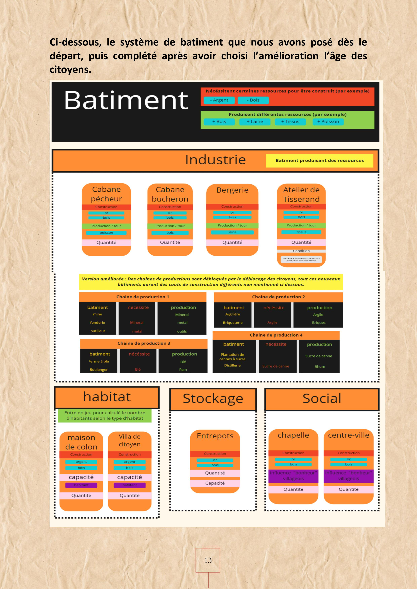
    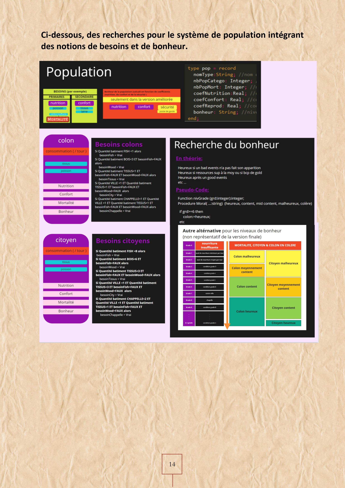
    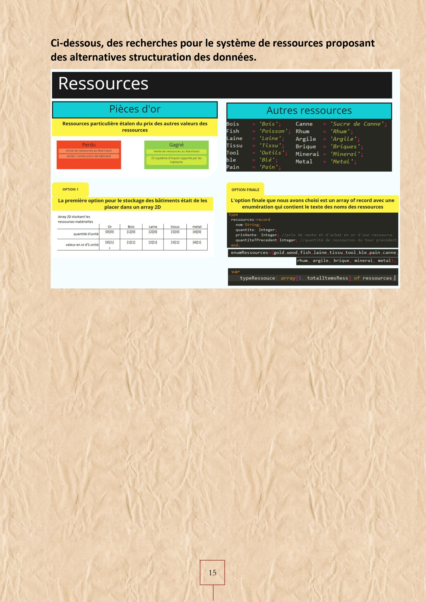
  

<h2>Qu'est-ce que m'a apporté ce projet ❓</h2>

Ce projet m'a permis d'améliorer ma connaissance en algorithmie, d'organiser mon code plus proprement, et surtout de travailler en équipe.

